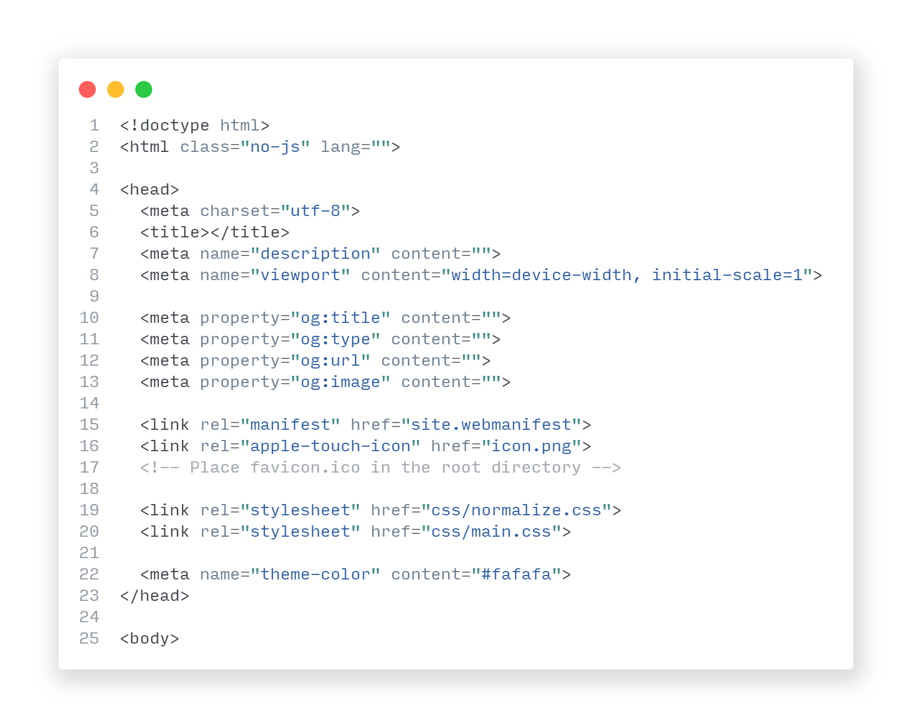

<h1 align="center">
  <br>
  <a href="#"></a>
  <br>
  Project Name
  <br>
</h1>

<h4 align="center">A short description of your project here.</h4>

<p align="center">
  <a href="#">
    
  </a>
  <a href="#">
    
  </a>
  <a href="#">
      
  </a>
  <a href="https://www.paypal.me/AmitMerchant">
    
  </a>
</p>

<p align="center">
  <a href="#key-features">Key Features</a> *
  <a href="#how-to-use">How To Use</a> *
  <a href="#download">Download</a> *
  <a href="#credits">Credits</a> *
  <a href="#related">Related</a> *
  <a href="#license">License</a>
</p>



## Key Features

-   Lorem ipsum dolor sit amet
-   In mattis hendrerit nulla
-   Vivamus vitae condimentum orci
-   Nam luctus dui ac tellus ullamcorper
-   Aenean sagittis, ligula sit amet congue porta
-   Praesent faucibus purus nec lorem bibendum
-   Pellentesque venenatis odio


## How To Use

To clone and run this application, you'll need [Git](https://git-scm.com) and [Node.js](https://nodejs.org/en/download/) (which comes with [npm](http://npmjs.com)) installed on your computer. From your command line:

```bash
# Clone this repository
$ git clone https://github.com/username/my-repo.git

# Go into the repository
$ cd my-repo

# Install dependencies
$ npm install

# Run the app
$ npm start
```

> &nbsp;
> **Note**
> If you're using Linux Bash for Windows, [see this guide](#) or use node from the command prompt.
> &nbsp;

## Download

You can [download](#) the latest installable version of Your Project for Windows, macOS and Linux.

## Credits

This software uses the following open source packages:

-   [Electron](http://electron.atom.io/)
-   [Node.js](https://nodejs.org/)
-   [Marked - a markdown parser](https://github.com/chjj/marked)
-   [showdown](http://showdownjs.github.io/showdown/)
-   [CodeMirror](http://codemirror.net/)
-   [highlight.js](https://highlightjs.org/)

## Related

[Another Project](#) - Description of this project.

## Support

<a href="https://www.buymeacoffee.com/5Zn8Xh3l9" target="_blank"></a>
<a href="https://www.patreon.com/amitmerchant">

</a>

## License

[MIT](LICENSE.MD)
